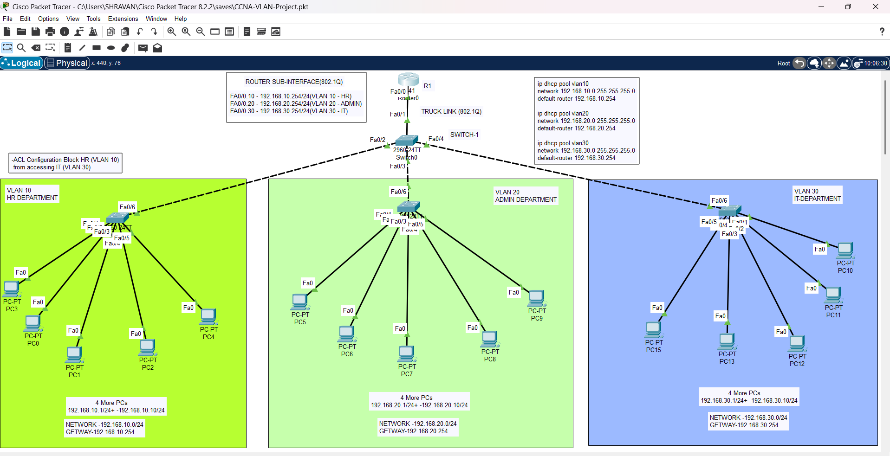

# inter-vlan-routing-dhcp-acl

##  Project Overview
This project demonstrates a **Router-on-a-Stick topology** using Cisco IOS.  
It includes:
- Inter-VLAN routing with sub-interfaces
- DHCP configuration for dynamic IP assignment
- ACLs for traffic control between departments
- Trunk link configuration between switch and router

##  Network Topology
Here is the topology used in this project:

##  VLAN Configuration
- **VLAN 10 – HR Department**
  - Network: 192.168.10.0/24
  - Gateway: 192.168.10.254
  - PCs: 192.168.10.1 – 192.168.10.10

- **VLAN 20 – Admin Department**
  - Network: 192.168.20.0/24
  - Gateway: 192.168.20.254
  - PCs: 192.168.20.1 – 192.168.20.10

- **VLAN 30 – IT Department**
  - Network: 192.168.30.0/24
  - Gateway: 192.168.30.254
  - PCs: 192.168.30.1 – 192.168.30.10

- **Router R1 Sub-Interfaces**
  
interface fa0/0.10 
 ip address 192.168.10.254 255.255.255.0

interface fa0/0.20 
 ip address 192.168.20.254 255.255.255.0

interface fa0/0.30 
 ip address 192.168.30.254 255.255.255.0

- **Switch Uplink (Trunk Link to Router R1)**  
 Use the port connected to the router (Fa0/1 or Fa0/24 depending on cabling):** 
 interface fa0/1 switchport mode trunk 
 switchport trunk allowed vlan 10,20,30 
 no shutdown

 
- DHCP Configuration:
  
 ip dhcp pool vlan10 
 network 192.168.10.0 255.255.255.0 
 default-router 192.168.10.254 

 ip dhcp pool vlan20 
 network 192.168.20.0 255.255.255.0 
 default-router 192.168.20.254 

ip dhcp pool vlan30 
 network 192.168.30.0 255.255.255.0 
 default-router 192.168.30.254 

- ACL Configuration
Block HR (VLAN 10) from accessing IT (VLAN 30): 

access-list 110 deny ip 192.168.10.0 0.0.0.255 192.168.30.0 0.0.0.255 
access-list 110 permit ip any any 
interface fa0/0.30 
 ip access-group 110 out 

## Verification Commands
- Show Access-Lists  
show access-lists
- Show DHCP Pools 
show ip dhcp pool
- Show Interfaces 
show ip interface brief
- Show Trunk Status (Switch) 
show interfaces trunk
- Ping Tests 
ping 192.168.20.1 
ping 192.168.30.1
- Ping Test with ACL
   - From HR VLAN (192.168.10.2) → IT VLAN (192.168.30.5) 
  Should fail (blocked by ACL 110). 
   - From HR VLAN (192.168.10.4) → Admin VLAN (192.168.20.9) 
  Should succeed (permitted by ACL 110). 
   - From Admin VLAN (192.168.20.2) → IT VLAN (192.168.30.5) 
  Should succeed (no restriction).

## Purpose
This lab is designed for NOC and cybersecurity interview preparation, showcasing practical skills in:

- VLAN segmentation
- DHCP automation
- ACL-based security
- Router-on-a-Stick topology with trunk link configuration
- Verification using ping tests
  

  

